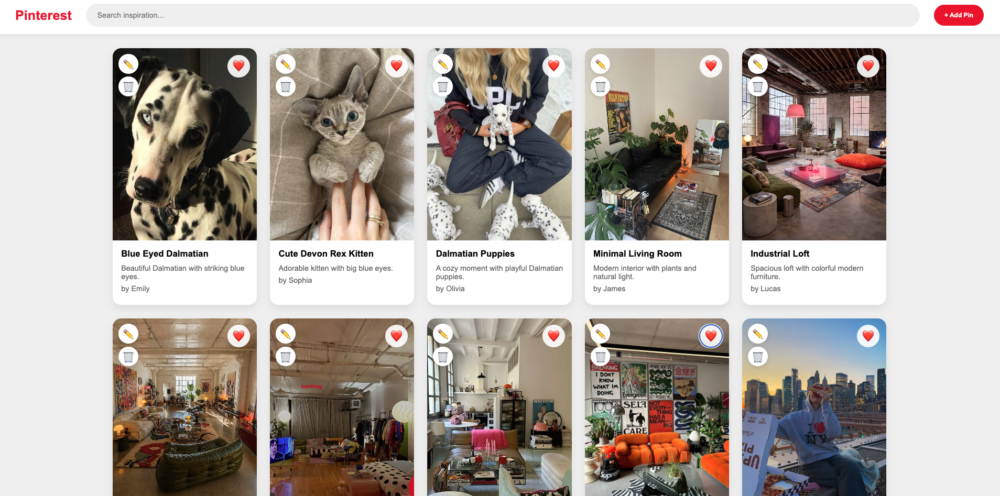

# Pinterest Clone

A Pinterest-inspired Single Page Application built with React, TypeScript and Vite.

## Project Status - MVP (Minimum Viable Product) – currently in progress.

This project contains the core functionality of a Pinterest-style application and is being actively extended with new features, automated tests, a .NET Web API backend and CI/CD pipelines.

## Features

- Display pins
- Search pins
- Add new pins
- Edit existing pins
- Delete pins
- Favorite pins
- Image upload with preview
- Local Storage persistence

## Tech Stack

- React
- TypeScript
- Vite
- CSS

## Application Preview



## Future Improvements

- Boards support
- Pin categories
- User authentication
- Backend integration
- Cloud image storage
- Improved responsive design

## Getting Started

```bash
npm install
npm run dev
```
